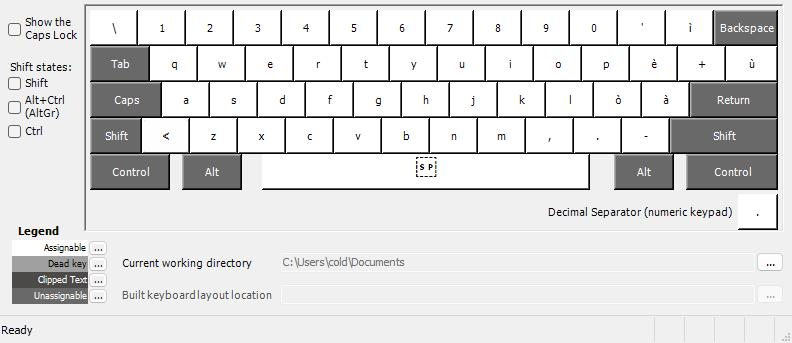
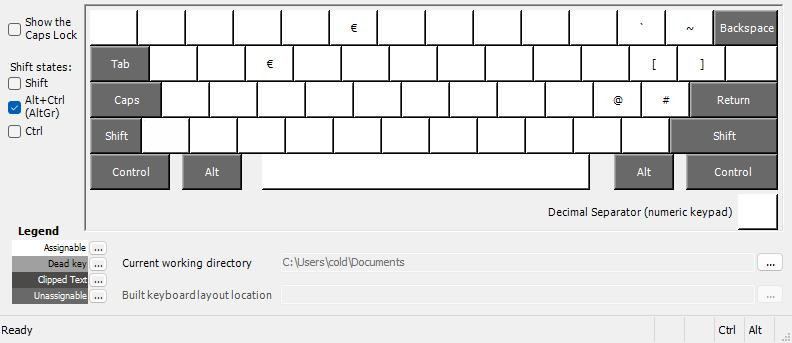
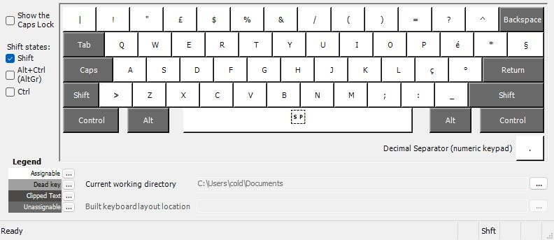

# Custom Keyboard with Italian layout for coding
## Layout Showcase 
- ### Normal layout
    
- ### AltGr layout
    
- ### Ctrl layout
    
- ### Shift layout
    
## But why?
Why not? This is a custom keyboard layout for Windows, created for developers. It includes the tilde (~) and backtick (`) characters, which are not normally available on the Italian keyboard.
## How to use it?
- ### Release Download
    To get started, simply go to the [Releases](https://github.com/ColdbloodDK/CustomKeyboardLayout/releases/) section and download the Release.zip archive, After that, unzip the file and open setup.exe.

- ### Build with MSKLC
    If you want to further modify the keyboard, clone the repository, download Microsoft Keyboard Layout Creator from the Microsoft website, click on File and load the source file ColdbloodDKCustomKeyboard.klc. After you have finished modifying your layout, use the functions Project > Validate Layout and Project > Test Keyboard Layout to check the layout's functionality. If everything seems fine, use the function Project > Build DLL and Setup Package

Made with 🧠 by ColdbloodDK

